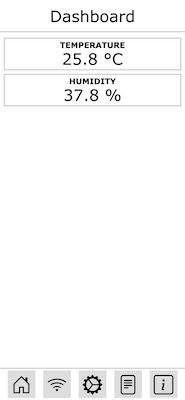
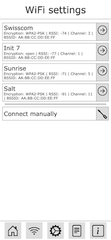
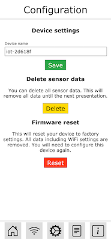

# Chrümeli

Chrümeli (swiss-german: "crumb") is an IOT-Framework for ESP8266. It delivers a few basic services like the wifi manager which allows to kickstart your IOT projects.

 |  | 
------------------------------------| ------------------------------- | -------------------------------------------
Dashboard                           | WiFi Manager                    | Configuration interface

## Features

* **Dashboard**: Shows directly your sensor data. Made possible with [VueJS](https://vuejs.org/).
* **REST-API**: Allows you to expose your sensors through REST.
* **Prometheus-API**: Data is also provided in [Prometheus](https://prometheus.io/) format. This is how you can fill your [Grafana](https://grafana.com) dashboards.
* **Captive Portal**: If the device is not connected to a WiFi it automatically spawns an access point where you can configure it.
* **WiFi Manager**: You can setup your WiFi connection directly via a Webfrontend.
* **TaskScheduler**: Never again filling up a your loop(). Use the included task scheduler instead and configure your service with ease.

## REST-API

Method | URI               | Description
-------| ----------------- | --------------
GET    | /api/sensor       | [Get all sensors](#get-all-sensors)
GET    | /api/sensor/:name | [Get sensor by :name](#get-sensor-by-name)

### Get all sensors

**URL**: GET /api/sensor

Gets the data of all sensors.

```json
[
    {
        "name": "temperature",
        "type": "temperature",
        "value": 25.8
    },
    {
        "name": "humidity",
        "type": "humidity",
        "value": 37.8
    }
]
```

### Get sensor by :name

**URL**: GET /api/sensor/:name

**Arguments:**
* **:name** : Name of the sensor

Gets a specific sensor by it's name.

**Example respose**
```json
{
    "name": "humidity",
    "type": "humidity",
    "value": 37.8
}
```

## Libraries used

* [ESP8266 Arduino SDK](https://github.com/esp8266/Arduino)
* [ESP Async Webserver](https://github.com/me-no-dev/ESPAsyncWebServer)
* [ArduinoJSON](https://arduinojson.org/)
* [CRC32](https://github.com/bakercp/CRC32)

## License

This stuff is released under the terms of the LGPL.

## Donate

If you want to donate for this project you can do it through [Github Sponsorship](https://github.com/sponsors/chrootlogin/).

Or you can send me some crypto-coins to the following address:

**Bitcoin**: bc1qvemyhud469qe4v6lcsn8sxu5e57m4sw3u2ujff